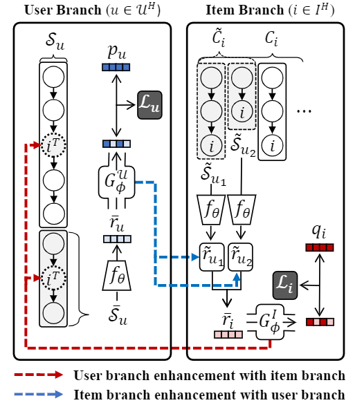

# **MELT: Mutual Enhancement of Long-Tailed User and Item for Sequential Recommendation**

<p align="center">   
    <a href="https://pytorch.org/" alt="PyTorch">
      </a>
    <a href="https://sigir.org/sigir2023/" alt="Conference">
        </a>
</p>

The official source code for [MELT: Mutual Enhancement of Long-Tailed User and Item for Sequential Recommendation paper](http://arxiv.org/abs/2304.08382), accepted at SIGIR(full paper) 2023.

<!-- ## **Main Figure**  
 -->

## **Data Preprocess**  

### **1. Download the raw datasets in the following links**  

* [Amazon](https://jmcauley.ucsd.edu/data/amazon/): Download the raw datasets instead of "5-core" datasets.

* [Behance](https://drive.google.com/drive/folders/0B9Ck8jw-TZUEc3NlMjVXdDlPU1k?resourcekey=0-6_8ykn0o4fLc5fuTEm91xA) : You can download the "Behance_appreciate_1M.gz" in the data explorer.

* [Foursquare](https://archive.org/details/201309_foursquare_dataset_umn)   
 

 
### **2. Then, put the raw datasets in the *raw_dataset* directory** 

### **3. Preprocess the datasets using **preprocess.ipynb** file**


## **Library Versions**

* Python: 3.9.12  
* Pytorch : 1.10  
* Numpy: 1.21.2  
* Pandas: 1.3.4  

We upload the **environment.yaml** file to directly install the required packages.

``` python  
conda env create --file environment.yaml
``` 

## **Pretrained Model**

We share the pretrained backbone encoder.  
You can donwload the pretrained model and put it on *save_model/DATA_NAME* directory.

* [SASRec](https://drive.google.com/drive/folders/1SKpdN_mAyMJgLTLSbqJOi3C9b8zm9Gbp?usp=sharing)

* [FMLP](https://drive.google.com/drive/folders/1D-dWuWKQB1VOwC91w26jjD1CvXqs2qx9?usp=sharing)

Or you can explicitly train the SASRec or FMLP model with the following commands.

### SASRec  

``` python  
python main.py --inference false --model SASRec e_max 201 --batch_size 128 --dataset {DATA}
```  

### FMLP 

``` python  
python main.py --inference false --model FMLP e_max 201 --batch_size 256 --dataset {DATA}
```  

## **Training MELT**  

### **MELT+SASRec**  

```python  
bash shell/MELT_SASRec/DATA.sh # DATA: Beauty, Behance, fsq, Music, Sports
```  

### **MELT+FMLP**  

``` python  
bash shell/MELT_FMLP/DATA.sh # DATA: Beauty, Behance, fsq, Music, Sports
```  

### **Hyperparameter Settings**  

* **MELT+SASRec**


|Data|lamb_U|lamb_I|e_max|Pareto(%) - a|  
|---|---|---|---|---|  
|Music|0.2|0.3|180|20|  
|Automotive|0.1|0.4|180|20|  
|Beauty|0.1|0.4|180|20|  
|Sports|0.4|0.3|200|20|  
|Clothing|0.3|0.2|200|20|  
|Grocery|0.1|0.3|180|20|  
|Foursquare|0.1|0.1|200|50|  
|Behance|0.1|0.2|180|50|

* **MELT+FMLP**  

|Data|Lamb_U|Lamb_I|E_max|Pareto(%) - a|  
|---|---|---|---|---|  
|Music|0.1|0.1|200|20|  
|Automotive|0.3|0.3|160|20|  
|Beauty|0.2|0.1|200|20|  
|Sports|0.2|0.3|180|20|  
|Clothing|0.4|0.3|180|20|  
|Grocery|0.2|0.2|200|20|  
|Foursquare|0.1|0.1|200|50|   
|Behance|0.1|0.3|200|50|


### Cite
```  
@misc{kim2023melt,
      title={MELT: Mutual Enhancement of Long-Tailed User and Item for Sequential Recommendation}, 
      author={Kibum Kim and Dongmin Hyun and Sukwon Yun and Chanyoung Park},
      year={2023},
      eprint={2304.08382},
      archivePrefix={arXiv},
      primaryClass={cs.IR}
}
```


